# Mootion - Technical Design Document

## Document Information

**Project Name:** Mootion  
**Version:** 1.0  
**Last Updated:** February 15, 2026  
**Status:** Design Phase  
**Purpose:** Define technical architecture, design decisions, and implementation strategy

---

## Table of Contents

1. [Design Philosophy](#design-philosophy)
2. [System Architecture](#system-architecture)
3. [Component Design](#component-design)
4. [Data Architecture](#data-architecture)
5. [Integration Architecture](#integration-architecture)
6. [Performance Design](#performance-design)
7. [Security Architecture](#security-architecture)
8. [Deployment Strategy](#deployment-strategy)
9. [Technology Stack](#technology-stack)

---

## Design Philosophy

### Core Architectural Principles

**1. Microservices with Shared Infrastructure**

Mootion adopts a hybrid architecture where learning modes (ASK, PLAY, EXAM) operate as independent services while sharing common infrastructure (database, cache, storage).

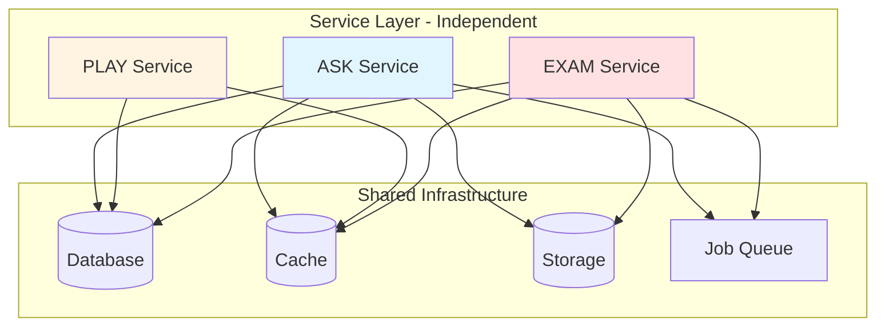

**Benefits:**
- Independent scaling per mode
- Fault isolation (one mode failure doesn't affect others)
- Parallel development by different teams
- Shared infrastructure reduces operational complexity

**Trade-offs:**
- More complex than monolith
- Network latency between services
- Distributed transaction challenges

**2. Event-Driven for Long Operations**

Long-running tasks (video generation, study plan creation) execute asynchronously through message queues, preventing timeouts and enabling real-time progress updates.

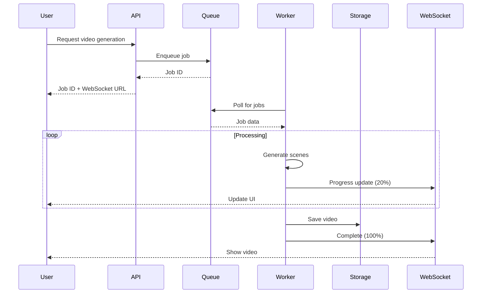

**Benefits:**
- No timeout issues for long operations
- Real-time progress feedback
- Better resource utilization
- Retry capability for failures

**Trade-offs:**
- Eventual consistency
- More complex error handling
- Requires WebSocket infrastructure

**3. Cache-First for Read Performance**

Frequently accessed data lives in Redis cache with explicit invalidation patterns, achieving sub-50ms response times.

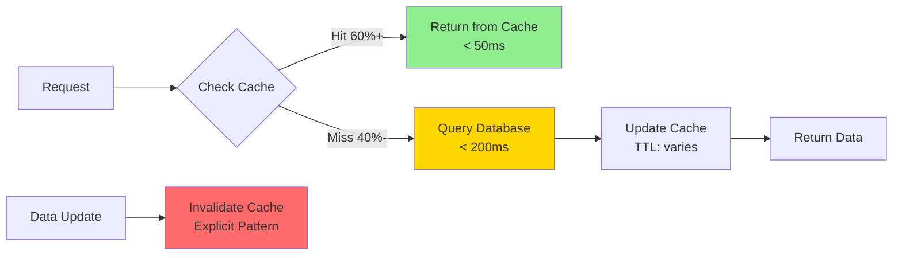

**Cache Strategy:**
- **Hot Data:** User sessions, recent videos, leaderboards (TTL: 5-15 min)
- **Warm Data:** Document metadata, quiz questions (TTL: 1 hour)
- **Cold Data:** Historical analytics, archived content (no cache)

**4. Progressive Enhancement**

Core functionality works on all devices; advanced features enhance experience on capable devices.

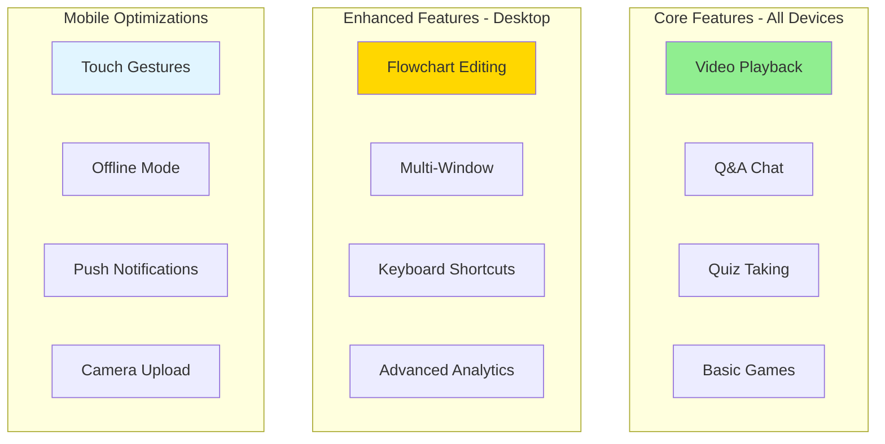

### Design Trade-offs Analysis

**Monolith vs. Microservices:**

| Aspect | Monolith | Microservices | Chosen |
|--------|----------|---------------|--------|
| Development Speed | Fast initially | Slower setup | Microservices |
| Scalability | Vertical only | Horizontal | Microservices |
| Operational Complexity | Low | High | Microservices |
| Fault Isolation | Poor | Excellent | Microservices |
| Team Independence | Low | High | Microservices |

**Decision:** Microservices for long-term scalability and team independence, accepting higher operational complexity.

**SQL vs. NoSQL:**

| Aspect | PostgreSQL | MongoDB | Chosen |
|--------|------------|---------|--------|
| Data Relationships | Excellent | Poor | PostgreSQL |
| Query Flexibility | SQL | Limited | PostgreSQL |
| Scalability | Vertical + Replicas | Horizontal | PostgreSQL |
| ACID Guarantees | Full | Limited | PostgreSQL |
| Schema Evolution | Migrations | Flexible | PostgreSQL |

**Decision:** PostgreSQL for strong consistency, relationships, and mature ecosystem.

**Sync vs. Async Processing:**

| Operation | Sync | Async | Chosen |
|-----------|------|-------|--------|
| Video Generation | Timeout risk | Complex | Async |
| Quiz Questions | Fast enough | Overkill | Sync |
| Study Plan | Medium time | Worth it | Async |
| Search | Fast | Unnecessary | Sync |

**Decision:** Async for operations >5 seconds, sync for everything else.

---

## System Architecture

### High-Level Architecture

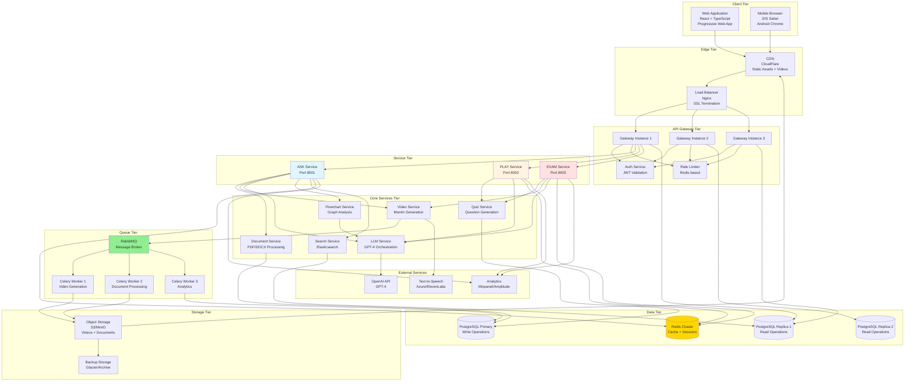

### Network Architecture

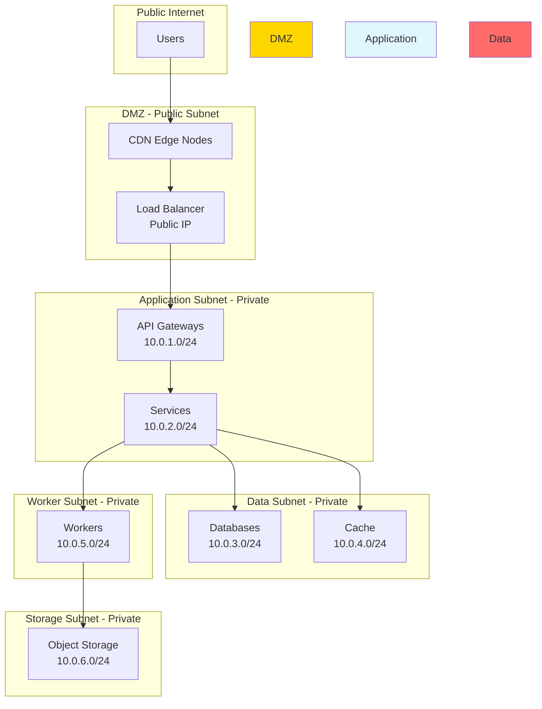

### Service Communication Patterns

**Synchronous Communication (REST):**

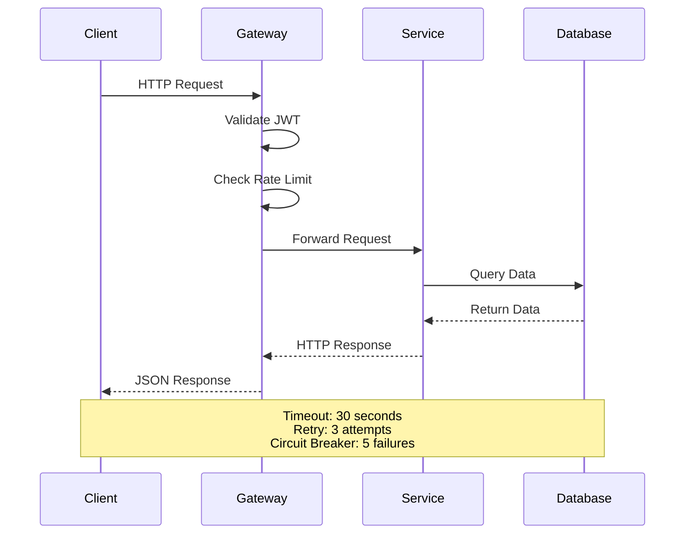

**Asynchronous Communication (Message Queue):**

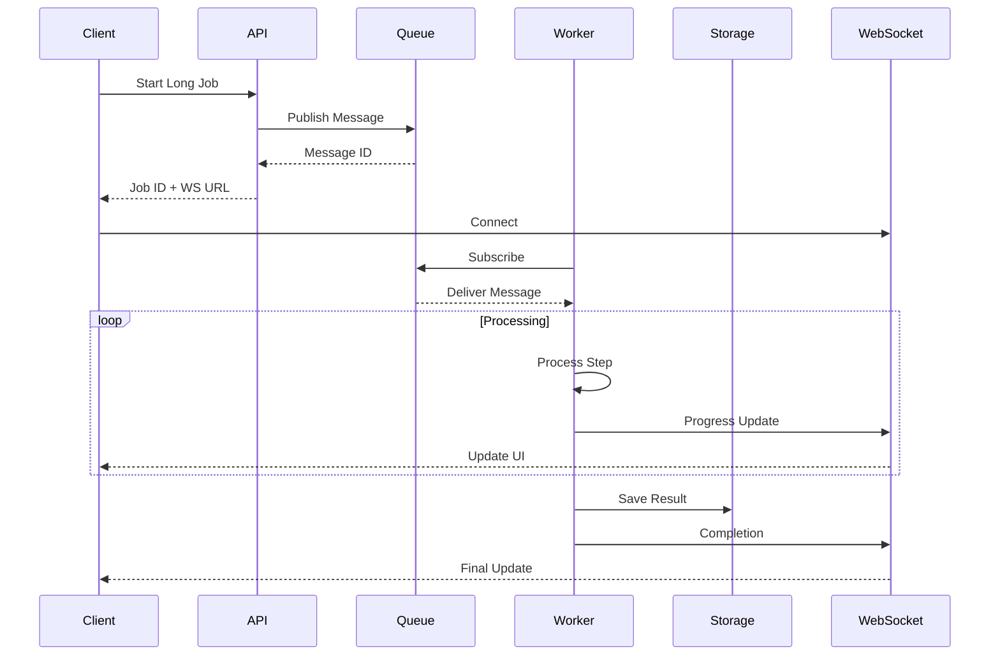

---

## Component Design

### ASK Mode Architecture

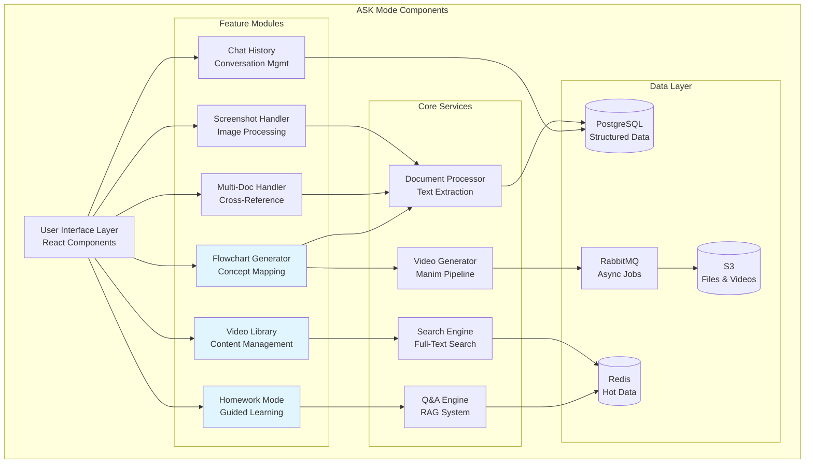

#### Concept Flowchart Generator - Detailed Design

**Processing Pipeline:**

```mermaid
graph LR
    A[Document Upload] --> B[Text Extraction<br/>PyPDF2/Docx]
    B --> C[Preprocessing<br/>Clean & Normalize]
    C --> D{Document Size}
    
    D -->|< 4000 tokens| E[Single LLM Call]
    D -->|> 4000 tokens| F[Chunking Strategy]
    
    F --> G[Split by Sections]
    G --> H[Process Each Chunk]
    H --> I[Merge Results]
    I --> J[Deduplicate]
    
    E --> K[Concept Extraction]
    J --> K
    
    K --> L[Relationship Inference<br/>Second LLM Call]
    L --> M[Graph Construction<br/>NetworkX]
    M --> N[Cycle Detection]
    N --> O[Layout Algorithm<br/>Dagre]
    O --> P[Serialize JSON]
    P --> Q[Cache Result<br/>TTL: 1 hour]
    Q --> R[Return to Frontend]
    
    style K fill:#FFD700
    style M fill:#90EE90
    style Q fill:#e1f5ff
```

**LLM Prompt Engineering:**

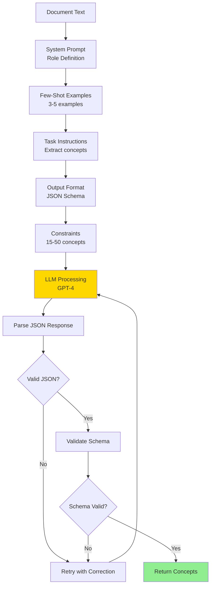

**Graph Data Structure:**

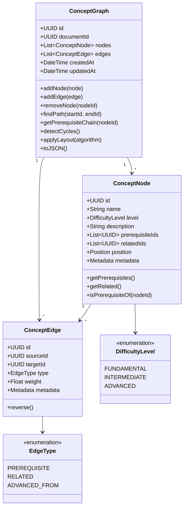

**Caching Strategy:**

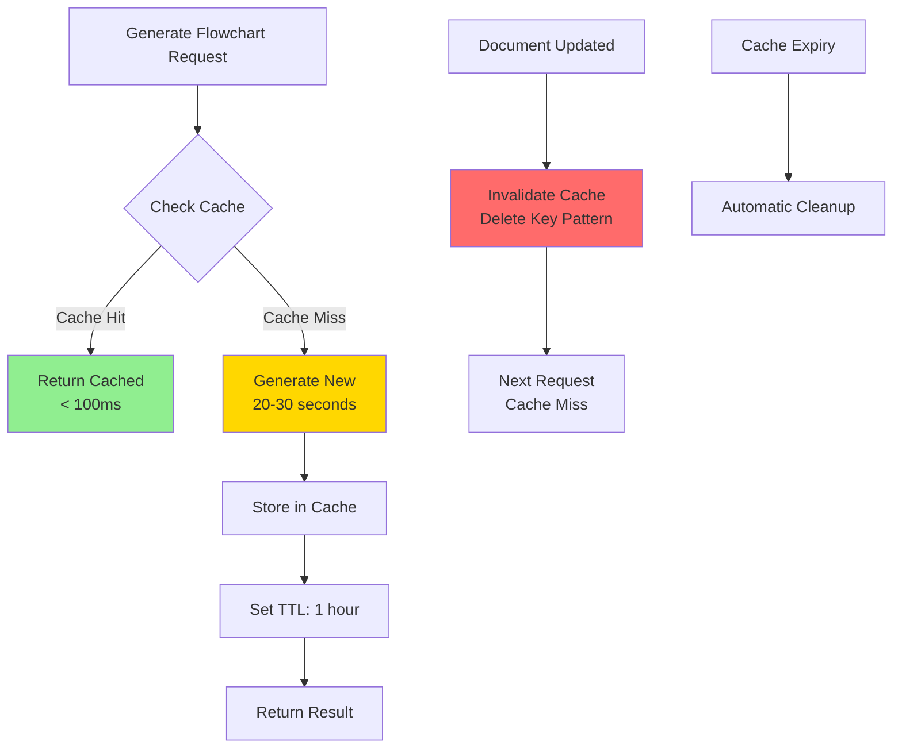

**Cache Key Pattern:**
```
flowchart:{document_id}:{version_hash}
```

**Invalidation Triggers:**
- Document content updated
- Document deleted
- Manual regeneration requested
- TTL expiration (1 hour)


#### Homework Mode - Detailed Design

**State Management:**

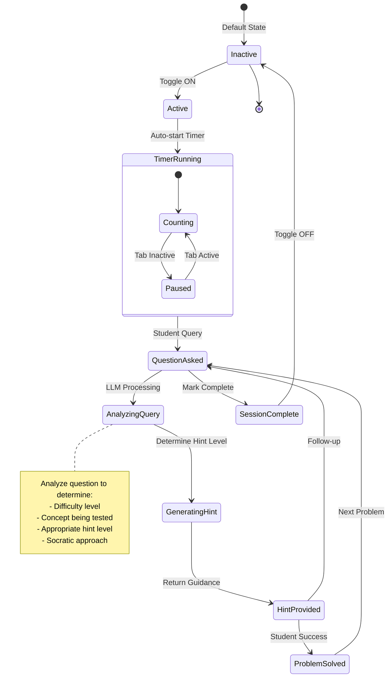

**LLM Behavior Modification:**

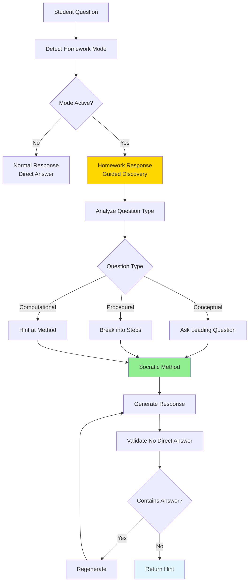

**Hint Level Progression:**

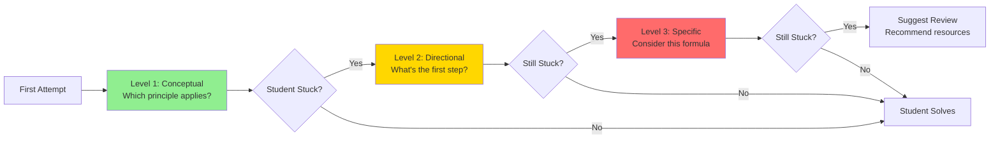

---

#### Video Library - Detailed Design

**Storage Architecture:**

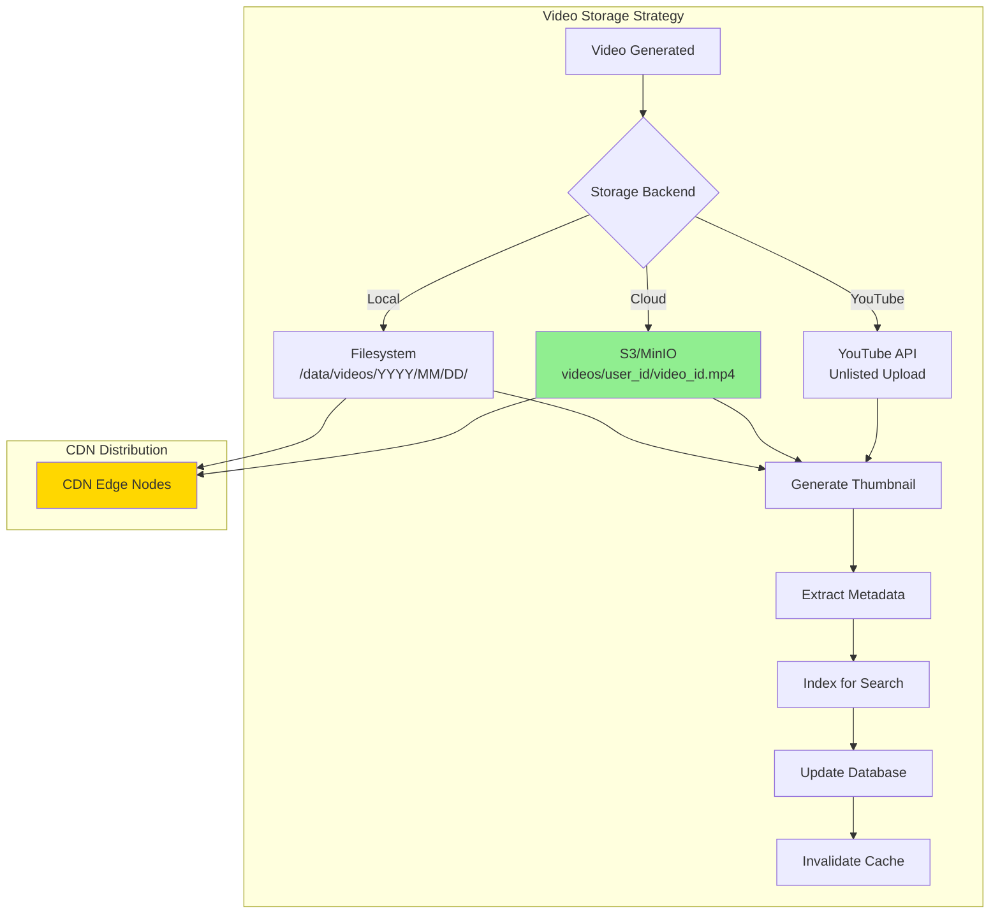

**Search Index Design:**

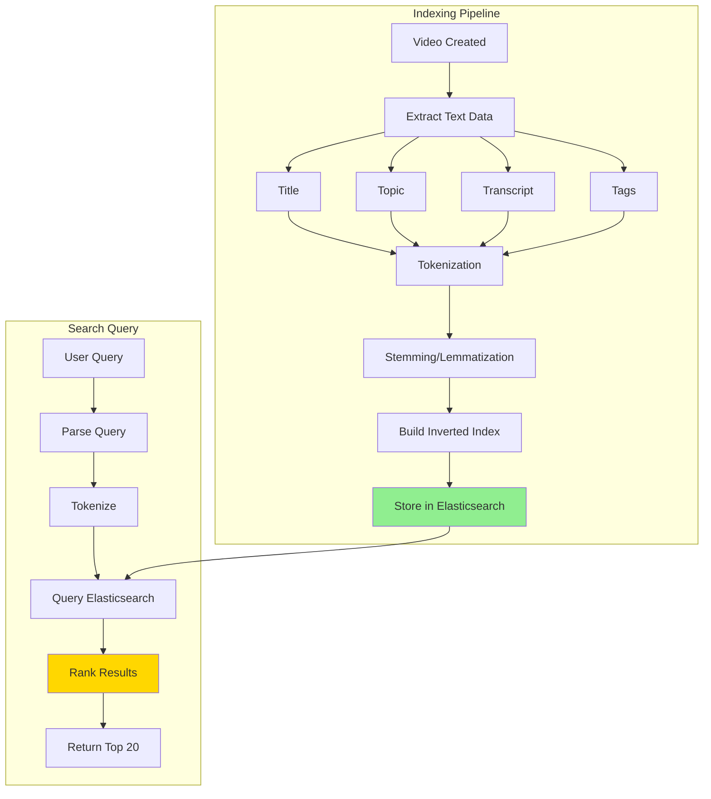

**Metadata Schema:**

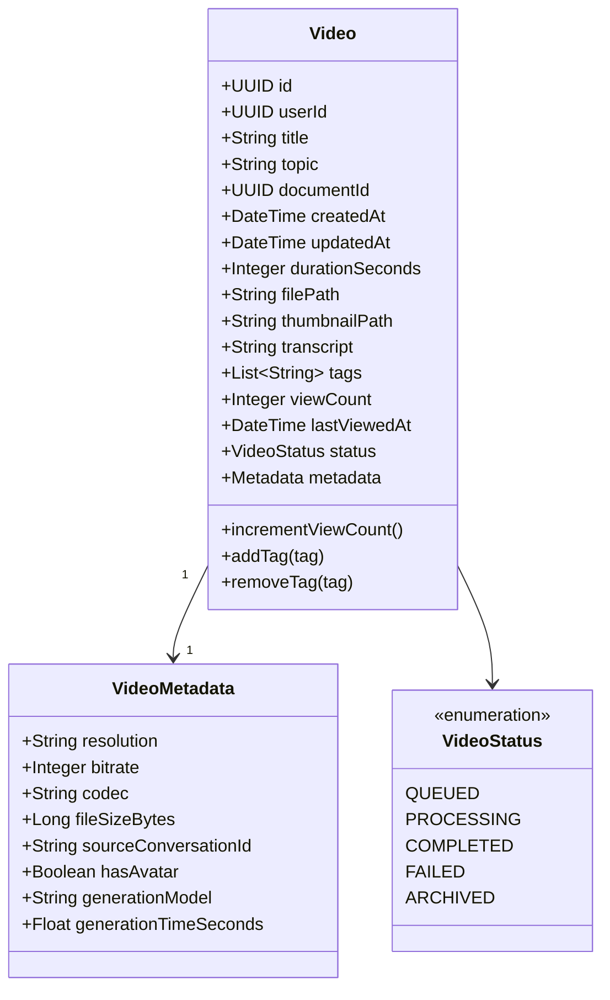

---

### PLAY Mode Architecture

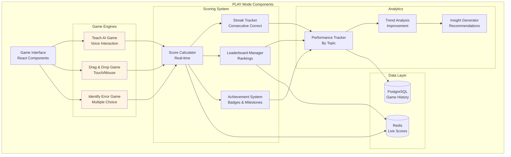

#### Scoring System - Detailed Design

**Score Calculation Engine:**

```mermaid
graph TB
    A[Correct Answer Event] --> B[Gather Inputs]
    
    B --> C[Base Points: 100]
    B --> D[Time Taken]
    B --> E[Attempt Number]
    B --> F[Current Streak]
    
    D --> G[Calculate Time Bonus<br/>50 × 1 - time/limit]
    E --> H[Calculate Accuracy<br/>1.0 / attempts]
    F --> I[Calculate Streak Bonus<br/>min10 × streak, 100]
    
    C --> J[Sum Base + Time]
    G --> J
    
    J --> K[Apply Accuracy Multiplier]
    H --> K
    
    K --> L[Add Streak Bonus]
    I --> L
    
    L --> M[Final Score]
    M --> N[Update User Total]
    M --> O[Update Leaderboard]
    M --> P[Check Achievements]
    
    style M fill:#FFD700
    style N fill:#90EE90
```

**Leaderboard Architecture:**

```mermaid
graph TB
    subgraph "Leaderboard Types"
        A[Daily Leaderboard<br/>Resets 00:00]
        B[Weekly Leaderboard<br/>Resets Monday]
        C[Monthly Leaderboard<br/>Resets 1st]
        D[All-Time Leaderboard<br/>Never Resets]
    end
    
    subgraph "Update Strategy"
        E[Score Event] --> F{Score Type}
        F -->|Game Score| G[Update All Boards]
        F -->|Practice| H[Update Daily Only]
        
        G --> I[Sorted Set in Redis]
        H --> I
        
        I --> J[ZADD user_id score]
        J --> K[ZREVRANGE 0 99]
        K --> L[Top 100 + User Position]
    end
    
    subgraph "Cache Strategy"
        M[Leaderboard Request] --> N{In Cache?}
        N -->|Yes| O[Return Cached<br/>TTL: 1 min]
        N -->|No| P[Query Redis]
        P --> Q[Cache Result]
        Q --> R[Return Data]
    end
    
    style I fill:#FFD700
    style O fill:#90EE90
```

---

### EXAM Mode Architecture

```mermaid
graph TB
    subgraph "EXAM Mode Components"
        UI[Exam Interface<br/>React Components]
        
        subgraph "Planning"
            SETUP[Exam Setup<br/>Date & Topics]
            PLAN[Study Plan Generator<br/>AI-Powered]
            CALENDAR[Calendar View<br/>Daily Schedule]
        end
        
        subgraph "Preparation"
            DAILY[Daily Study View<br/>Today's Tasks]
            CRAM[Cram Mode<br/>Condensed Content]
            WEAK[Weak Spot Identifier<br/>Performance Analysis]
        end
        
        subgraph "Testing"
            MOCK[Mock Exam Generator<br/>Full-Length Tests]
            GRADE[Auto-Grader<br/>Instant Results]
            REPORT[Performance Report<br/>Detailed Analysis]
        end
        
        subgraph "Data Layer"
            DB[(PostgreSQL<br/>Plans & Results)]
            CACHE[(Redis<br/>Progress Tracking)]
            QUEUE[RabbitMQ<br/>Plan Generation]
        end
    end
    
    UI --> SETUP
    UI --> CALENDAR
    UI --> DAILY
    UI --> CRAM
    UI --> WEAK
    UI --> MOCK
    
    SETUP --> PLAN
    PLAN --> CALENDAR
    CALENDAR --> DAILY
    
    DAILY --> WEAK
    WEAK --> CRAM
    CRAM --> MOCK
    
    MOCK --> GRADE
    GRADE --> REPORT
    
    PLAN --> QUEUE
    MOCK --> DB
    GRADE --> DB
    REPORT --> DB
    
    DAILY --> CACHE
    WEAK --> CACHE
    
    style SETUP fill:#ffe1e1
    style PLAN fill:#ffe1e1
    style MOCK fill:#ffe1e1
```

#### Study Plan Generator - Detailed Design

**Plan Generation Algorithm:**

```mermaid
graph TB
    A[Exam Inputs] --> B[Calculate Available Time]
    A --> C[Analyze Topics]
    A --> D[User Preferences]
    
    B --> E[Days Until Exam]
    B --> F[Hours Per Day]
    E --> G[Total Study Hours]
    F --> G
    
    C --> H[LLM Topic Analysis]
    H --> I[Difficulty Scores]
    H --> J[Prerequisite Chains]
    H --> K[Estimated Hours]
    
    D --> L[Study Time Preferences]
    D --> M[Existing Knowledge]
    
    G --> N[Time Allocation]
    I --> N
    J --> N
    K --> N
    L --> N
    M --> N
    
    N --> O[Generate Daily Schedule]
    O --> P[Add Review Sessions]
    P --> Q[Schedule Mock Exams]
    Q --> R[Add Buffer Time]
    R --> S[Optimize Sequence]
    S --> T[Final Study Plan]
    
    style H fill:#FFD700
    style N fill:#90EE90
    style T fill:#e1f5ff
```

**Daily Schedule Structure:**

```mermaid
classDiagram
    class StudyPlan {
        +UUID id
        +UUID userId
        +UUID examId
        +Date examDate
        +List~Topic~ topics
        +Float hoursPerDay
        +List~DailySchedule~ schedule
        +DateTime createdAt
        +PlanStatus status
        +getToday()
        +getProgress()
        +adjustSchedule()
    }
    
    class DailySchedule {
        +Date date
        +List~StudyTask~ tasks
        +Float totalHours
        +Float completedHours
        +Boolean isComplete
        +addTask(task)
        +completeTask(taskId)
        +getProgress()
    }
    
    class StudyTask {
        +UUID id
        +String topic
        +TaskType type
        +Float durationHours
        +Boolean completed
        +DateTime completedAt
        +List~String~ resources
        +complete()
    }
    
    class TaskType {
        <<enumeration>>
        STUDY
        REVIEW
        PRACTICE
        MOCK_EXAM
        CRAM
    }
    
    class PlanStatus {
        <<enumeration>>
        ACTIVE
        ON_TRACK
        BEHIND
        AHEAD
        COMPLETED
    }
    
    StudyPlan "1" --> "*" DailySchedule
    DailySchedule "1" --> "*" StudyTask
    StudyTask --> TaskType
    StudyPlan --> PlanStatus
```

#### Weak Spot Identification - Detailed Design

**Performance Analysis Pipeline:**

```mermaid
graph TB
    A[Quiz Results] --> B[Aggregate by Topic]
    B --> C[Calculate Accuracy]
    C --> D{Accuracy < 70%?}
    
    D -->|Yes| E[Flag as Weak Spot]
    D -->|No| F[Mark as Strong]
    
    E --> G[Calculate Priority]
    
    G --> H[Factor: Accuracy<br/>Weight: 50%]
    G --> I[Factor: Attempts<br/>Weight: 20%]
    G --> J[Factor: Time Taken<br/>Weight: 15%]
    G --> K[Factor: Exam Weight<br/>Weight: 15%]
    
    H --> L[Priority Score]
    I --> L
    J --> L
    K --> L
    
    L --> M[Rank Weak Spots]
    M --> N[Generate Recommendations]
    
    N --> O[Targeted Practice Quiz]
    N --> P[Study Material Links]
    N --> Q[Video Recommendations]
    
    style E fill:#FF6B6B
    style F fill:#90EE90
    style M fill:#FFD700
```

**Weak Spot Dashboard:**

```mermaid
graph LR
    subgraph "Critical - Priority 1"
        A1[Calculus<br/>Accuracy: 45%<br/>Priority: 95]
        A2[Trigonometry<br/>Accuracy: 48%<br/>Priority: 88]
    end
    
    subgraph "Needs Work - Priority 2"
        B1[Algebra<br/>Accuracy: 62%<br/>Priority: 65]
        B2[Geometry<br/>Accuracy: 68%<br/>Priority: 58]
    end
    
    subgraph "Strong - No Action"
        C1[Arithmetic<br/>Accuracy: 85%<br/>Priority: 15]
        C2[Statistics<br/>Accuracy: 92%<br/>Priority: 8]
    end
    
    A1 --> D[Practice Quiz<br/>20 questions]
    A2 --> D
    B1 --> E[Review Videos<br/>Key concepts]
    B2 --> E
    
    style A1 fill:#FF6B6B
    style B1 fill:#FFD700
    style C1 fill:#90EE90
```

---

## Data Architecture

### Database Schema Design

**Core Tables:**

```mermaid
erDiagram
    USERS ||--o{ DOCUMENTS : uploads
    USERS ||--o{ VIDEOS : generates
    USERS ||--o{ CONVERSATIONS : has
    USERS ||--o{ EXAMS : creates
    USERS ||--o{ GAME_SESSIONS : plays
    
    DOCUMENTS ||--o{ VIDEOS : sources
    DOCUMENTS ||--o{ FLOWCHARTS : generates
    DOCUMENTS ||--o{ CONVERSATIONS : references
    
    VIDEOS ||--o{ VIDEO_TAGS : has
    
    CONVERSATIONS ||--o{ MESSAGES : contains
    
    EXAMS ||--o{ STUDY_PLANS : has
    EXAMS ||--o{ MOCK_EXAMS : includes
    
    STUDY_PLANS ||--o{ DAILY_SCHEDULES : contains
    DAILY_SCHEDULES ||--o{ STUDY_TASKS : includes
    
    MOCK_EXAMS ||--o{ MOCK_EXAM_RESULTS : produces
    MOCK_EXAM_RESULTS ||--o{ QUESTION_RESULTS : contains
    
    GAME_SESSIONS ||--o{ GAME_ANSWERS : records
    
    USERS {
        uuid id PK
        string email UK
        string password_hash
        string username
        timestamp created_at
        timestamp last_login
        jsonb preferences
    }
    
    DOCUMENTS {
        uuid id PK
        uuid user_id FK
        string title
        string file_path
        integer page_count
        text content
        timestamp created_at
        string status
    }
    
    VIDEOS {
        uuid id PK
        uuid user_id FK
        uuid document_id FK
        string title
        string topic
        integer duration_seconds
        string file_path
        string thumbnail_path
        text transcript
        integer view_count
        timestamp created_at
    }
    
    EXAMS {
        uuid id PK
        uuid user_id FK
        string name
        date exam_date
        jsonb topics
        float hours_per_day
        timestamp created_at
    }
    
    STUDY_PLANS {
        uuid id PK
        uuid exam_id FK
        jsonb schedule
        string status
        timestamp created_at
    }
```

### Data Partitioning Strategy

```mermaid
graph TB
    subgraph "Hot Data - Frequent Access"
        A[Active Users<br/>Last 30 days]
        B[Recent Videos<br/>Last 7 days]
        C[Current Exams<br/>Future dates]
        D[Live Game Sessions<br/>In progress]
    end
    
    subgraph "Warm Data - Occasional Access"
        E[Historical Videos<br/>30-90 days]
        F[Completed Exams<br/>Past 90 days]
        G[Old Conversations<br/>30-90 days]
    end
    
    subgraph "Cold Data - Rare Access"
        H[Archived Videos<br/>> 90 days]
        I[Old Exam Results<br/>> 90 days]
        J[Historical Analytics<br/>> 90 days]
    end
    
    A --> K[Primary Database<br/>SSD Storage]
    B --> K
    C --> K
    D --> K
    
    E --> L[Secondary Database<br/>Standard Storage]
    F --> L
    G --> L
    
    H --> M[Archive Storage<br/>Glacier/Cold Storage]
    I --> M
    J --> M
    
    style K fill:#90EE90
    style L fill:#FFD700
    style M fill:#e1f5ff
```

### Caching Strategy

**Cache Layers:**

```mermaid
graph TB
    subgraph "L1 Cache - Application Memory"
        A[Static Config<br/>App startup]
        B[User Session<br/>JWT data]
        C[Feature Flags<br/>Rarely change]
    end
    
    subgraph "L2 Cache - Redis"
        D[User Data<br/>TTL: 15 min]
        E[Video Metadata<br/>TTL: 1 hour]
        F[Quiz Questions<br/>TTL: 30 min]
        G[Leaderboards<br/>TTL: 1 min]
        H[Search Results<br/>TTL: 5 min]
    end
    
    subgraph "L3 Cache - CDN"
        I[Static Assets<br/>TTL: 1 day]
        J[Video Files<br/>TTL: 7 days]
        K[Thumbnails<br/>TTL: 1 day]
    end
    
    L[Request] --> A
    A -->|Miss| D
    D -->|Miss| M[(Database)]
    
    N[Video Request] --> I
    I -->|Miss| J
    J -->|Miss| O[(Object Storage)]
    
    style A fill:#90EE90
    style D fill:#FFD700
    style I fill:#e1f5ff
```

**Cache Invalidation Patterns:**

```mermaid
graph LR
    A[Data Update Event] --> B{Invalidation Strategy}
    
    B -->|Write-Through| C[Update Cache<br/>Update DB]
    B -->|Write-Behind| D[Update DB<br/>Async Update Cache]
    B -->|Cache-Aside| E[Invalidate Cache<br/>Next Read Refreshes]
    
    C --> F[Immediate Consistency]
    D --> G[Eventual Consistency]
    E --> H[Lazy Loading]
    
    style C fill:#90EE90
    style D fill:#FFD700
    style E fill:#e1f5ff
```

---

## Integration Architecture

### External Service Integration

```mermaid
graph TB
    subgraph "Mootion Services"
        API[API Gateway]
    end
    
    subgraph "AI Services"
        OPENAI[OpenAI API<br/>GPT-4]
        CLAUDE[Anthropic Claude<br/>Backup LLM]
        TTS[Text-to-Speech<br/>Azure/ElevenLabs]
    end
    
    subgraph "Infrastructure Services"
        S3[Object Storage<br/>AWS S3/MinIO]
        CDN[CDN<br/>CloudFlare]
        EMAIL[Email Service<br/>SendGrid]
        SMS[SMS Service<br/>Twilio]
    end
    
    subgraph "Analytics Services"
        ANALYTICS[Analytics<br/>Mixpanel]
        ERROR[Error Tracking<br/>Sentry]
        LOGS[Log Management<br/>DataDog]
    end
    
    API --> OPENAI
    API --> CLAUDE
    API --> TTS
    API --> S3
    API --> CDN
    API --> EMAIL
    API --> SMS
    API --> ANALYTICS
    API --> ERROR
    API --> LOGS
    
    style OPENAI fill:#FFD700
    style S3 fill:#90EE90
    style ANALYTICS fill:#e1f5ff
```

### API Integration Patterns

**Circuit Breaker Pattern:**

```mermaid
stateDiagram-v2
    [*] --> Closed: Normal Operation
    Closed --> Open: Failure Threshold<br/>5 failures in 1 min
    Open --> HalfOpen: Timeout<br/>30 seconds
    HalfOpen --> Closed: Success
    HalfOpen --> Open: Failure
    
    note right of Closed
        All requests pass through
        Track failure rate
    end note
    
    note right of Open
        Fail fast
        Return cached/default
        No external calls
    end note
    
    note right of HalfOpen
        Allow test request
        Evaluate health
    end note
```

**Retry Strategy:**

```mermaid
graph LR
    A[API Call] --> B{Success?}
    B -->|Yes| C[Return Result]
    B -->|No| D{Retryable?}
    
    D -->|No| E[Return Error]
    D -->|Yes| F{Attempt < 3?}
    
    F -->|No| E
    F -->|Yes| G[Wait Exponential<br/>2^attempt seconds]
    G --> H[Retry Call]
    H --> B
    
    style C fill:#90EE90
    style E fill:#FF6B6B
```

---

**End of Design Document - Part 1**

*Continued in next section...*

## Performance Design

### Performance Optimization Strategy

**Multi-Level Optimization:**

```mermaid
graph TB
    subgraph "Frontend Optimization"
        A[Code Splitting<br/>Lazy Loading]
        B[Asset Optimization<br/>Minification]
        C[Image Optimization<br/>WebP + Lazy Load]
        D[Virtual Scrolling<br/>Large Lists]
    end
    
    subgraph "API Optimization"
        E[Response Compression<br/>Gzip/Brotli]
        F[Pagination<br/>Limit Results]
        G[Field Selection<br/>GraphQL-style]
        H[Batch Requests<br/>Reduce Round Trips]
    end
    
    subgraph "Database Optimization"
        I[Strategic Indexes<br/>Query Performance]
        J[Connection Pooling<br/>Reuse Connections]
        K[Read Replicas<br/>Distribute Load]
        L[Query Optimization<br/>Explain Plans]
    end
    
    subgraph "Caching Strategy"
        M[Redis Cache<br/>Hot Data]
        N[CDN Cache<br/>Static Assets]
        O[Browser Cache<br/>Client-side]
        P[Application Cache<br/>In-Memory]
    end
    
    style A fill:#e1f5ff
    style E fill:#fff4e1
    style I fill:#ffe1e1
    style M fill:#FFD700
```

### Database Performance

**Index Strategy:**

```mermaid
graph TB
    A[Query Analysis] --> B{Query Type}
    
    B -->|Equality| C[B-Tree Index<br/>WHERE id = ?]
    B -->|Range| D[B-Tree Index<br/>WHERE date > ?]
    B -->|Full-Text| E[GIN Index<br/>Search content]
    B -->|Spatial| F[GiST Index<br/>Geographic data]
    
    C --> G[Single Column<br/>High Selectivity]
    C --> H[Composite Index<br/>Multiple Columns]
    
    D --> I[Covering Index<br/>Include Columns]
    
    E --> J[tsvector Column<br/>Preprocessed Text]
    
    style C fill:#90EE90
    style E fill:#FFD700
```

**Query Optimization Patterns:**

```mermaid
graph LR
    subgraph "Anti-Patterns"
        A1[SELECT *]
        A2[N+1 Queries]
        A3[No Indexes]
        A4[Large OFFSET]
    end
    
    subgraph "Best Practices"
        B1[SELECT specific columns]
        B2[JOIN or Batch]
        B3[Strategic Indexes]
        B4[Cursor Pagination]
    end
    
    A1 -.->|Replace| B1
    A2 -.->|Replace| B2
    A3 -.->|Replace| B3
    A4 -.->|Replace| B4
    
    style A1 fill:#FF6B6B
    style B1 fill:#90EE90
```

### Caching Performance

**Cache Hit Rate Optimization:**

```mermaid
graph TB
    A[Monitor Cache Metrics] --> B{Hit Rate}
    
    B -->|< 50%| C[Low Hit Rate<br/>Problem]
    B -->|50-70%| D[Acceptable<br/>Monitor]
    B -->|> 70%| E[Good<br/>Maintain]
    
    C --> F[Analyze Patterns]
    F --> G{Root Cause}
    
    G -->|Short TTL| H[Increase TTL]
    G -->|Wrong Data| I[Cache Different Data]
    G -->|High Churn| J[Implement Warming]
    G -->|Large Keys| K[Optimize Key Size]
    
    H --> L[Re-measure]
    I --> L
    J --> L
    K --> L
    
    L --> B
    
    style C fill:#FF6B6B
    style D fill:#FFD700
    style E fill:#90EE90
```

### Video Generation Performance

**Parallel Processing Pipeline:**

```mermaid
graph LR
    A[Video Request] --> B[Scene Planning<br/>LLM]
    B --> C[Split into Scenes]
    
    C --> D1[Scene 1<br/>Worker 1]
    C --> D2[Scene 2<br/>Worker 2]
    C --> D3[Scene 3<br/>Worker 3]
    C --> D4[Scene N<br/>Worker N]
    
    D1 --> E[Collect Results]
    D2 --> E
    D3 --> E
    D4 --> E
    
    E --> F[Stitch Scenes]
    F --> G[Add Audio]
    G --> H[Final Video]
    
    style C fill:#FFD700
    style E fill:#90EE90
```

---

## Security Architecture

### Authentication & Authorization

**JWT-Based Authentication Flow:**

```mermaid
sequenceDiagram
    participant User
    participant Frontend
    participant Gateway
    participant AuthService
    participant Database
    
    User->>Frontend: Login (email, password)
    Frontend->>Gateway: POST /auth/login
    Gateway->>AuthService: Validate credentials
    AuthService->>Database: Query user
    Database-->>AuthService: User data
    AuthService->>AuthService: Verify password hash
    AuthService->>AuthService: Generate JWT
    AuthService-->>Gateway: Access + Refresh tokens
    Gateway-->>Frontend: Tokens + User data
    Frontend->>Frontend: Store tokens (httpOnly cookie)
    
    Note over User,Database: Subsequent Requests
    
    User->>Frontend: Access protected resource
    Frontend->>Gateway: Request + JWT
    Gateway->>Gateway: Validate JWT signature
    Gateway->>Gateway: Check expiration
    Gateway->>Gateway: Extract user_id
    Gateway->>Service: Forward with user context
    Service-->>Gateway: Response
    Gateway-->>Frontend: Response
```

**Role-Based Access Control:**

```mermaid
graph TB
    subgraph "User Roles"
        A[Student<br/>Basic Access]
        B[Teacher<br/>Extended Access]
        C[Admin<br/>Full Access]
    end
    
    subgraph "Permissions"
        D[View Own Content]
        E[Generate Videos]
        F[Take Quizzes]
        G[View All Students]
        H[Create Assignments]
        I[Manage Users]
        J[System Config]
    end
    
    A --> D
    A --> E
    A --> F
    
    B --> D
    B --> E
    B --> F
    B --> G
    B --> H
    
    C --> D
    C --> E
    C --> F
    C --> G
    C --> H
    C --> I
    C --> J
    
    style A fill:#e1f5ff
    style B fill:#FFD700
    style C fill:#FF6B6B
```

### Data Security

**Encryption Strategy:**

```mermaid
graph TB
    subgraph "Data at Rest"
        A[Database<br/>AES-256]
        B[Object Storage<br/>Server-Side Encryption]
        C[Backups<br/>Encrypted Archives]
    end
    
    subgraph "Data in Transit"
        D[HTTPS/TLS 1.3<br/>All Communications]
        E[WebSocket Secure<br/>WSS Protocol]
        F[API to API<br/>mTLS]
    end
    
    subgraph "Sensitive Data"
        G[Passwords<br/>bcrypt hash]
        H[API Keys<br/>Encrypted in DB]
        I[PII<br/>Encrypted columns]
    end
    
    style A fill:#90EE90
    style D fill:#90EE90
    style G fill:#90EE90
```

### Input Validation & Sanitization

**Validation Pipeline:**

```mermaid
graph LR
    A[User Input] --> B[Type Validation<br/>String/Number/etc]
    B --> C[Format Validation<br/>Email/URL/etc]
    C --> D[Length Validation<br/>Min/Max]
    D --> E[Content Validation<br/>Allowed chars]
    E --> F[Sanitization<br/>Remove dangerous]
    F --> G[Business Logic<br/>Validation]
    G --> H{Valid?}
    
    H -->|Yes| I[Process Request]
    H -->|No| J[Return 400 Error<br/>Clear message]
    
    style I fill:#90EE90
    style J fill:#FF6B6B
```

### Rate Limiting

**Multi-Tier Rate Limiting:**

```mermaid
graph TB
    subgraph "Global Limits"
        A[1000 req/min<br/>Per IP]
        B[10000 req/min<br/>Per Server]
    end
    
    subgraph "User Limits"
        C[100 req/min<br/>Authenticated User]
        D[10 videos/hour<br/>Generation Limit]
        E[50 quizzes/day<br/>Quiz Limit]
    end
    
    subgraph "Endpoint Limits"
        F[5 req/min<br/>Login Endpoint]
        G[20 req/min<br/>Search Endpoint]
        H[1 req/10sec<br/>Video Generation]
    end
    
    I[Request] --> A
    A --> C
    C --> F
    
    style A fill:#FFD700
    style C fill:#90EE90
    style F fill:#FF6B6B
```

---

## Deployment Strategy

### Infrastructure Architecture

**Multi-Region Deployment:**

```mermaid
graph TB
    subgraph "Region: US-East"
        A1[Load Balancer]
        A2[API Servers x3]
        A3[Database Primary]
        A4[Redis Cluster]
        A5[Worker Pool x5]
    end
    
    subgraph "Region: US-West"
        B1[Load Balancer]
        B2[API Servers x3]
        B3[Database Replica]
        B4[Redis Cluster]
        B5[Worker Pool x5]
    end
    
    subgraph "Region: EU-West"
        C1[Load Balancer]
        C2[API Servers x3]
        C3[Database Replica]
        C4[Redis Cluster]
        C5[Worker Pool x5]
    end
    
    subgraph "Global Services"
        D1[CDN<br/>CloudFlare]
        D2[Object Storage<br/>S3]
        D3[DNS<br/>Route53]
    end
    
    D3 --> A1
    D3 --> B1
    D3 --> C1
    
    A3 -.->|Replication| B3
    A3 -.->|Replication| C3
    
    A2 --> D2
    B2 --> D2
    C2 --> D2
    
    D2 --> D1
    
    style A3 fill:#90EE90
    style B3 fill:#FFD700
    style C3 fill:#FFD700
```

### Container Architecture

**Docker Container Strategy:**

```mermaid
graph TB
    subgraph "Application Containers"
        A[API Gateway<br/>Node.js]
        B[ASK Service<br/>Python]
        C[PLAY Service<br/>Python]
        D[EXAM Service<br/>Python]
        E[Worker<br/>Python + Manim]
    end
    
    subgraph "Data Containers"
        F[PostgreSQL<br/>Official Image]
        G[Redis<br/>Official Image]
        H[RabbitMQ<br/>Official Image]
    end
    
    subgraph "Infrastructure"
        I[Nginx<br/>Reverse Proxy]
        J[Prometheus<br/>Monitoring]
        K[Grafana<br/>Dashboards]
    end
    
    I --> A
    A --> B
    A --> C
    A --> D
    
    B --> F
    B --> G
    C --> F
    C --> G
    D --> F
    D --> G
    
    E --> H
    E --> F
    
    J --> A
    J --> B
    J --> C
    J --> D
    K --> J
    
    style A fill:#e1f5ff
    style B fill:#e1f5ff
    style F fill:#FFD700
```

### CI/CD Pipeline

**Deployment Pipeline:**

```mermaid
graph LR
    A[Code Push] --> B[GitHub Actions]
    B --> C[Run Tests<br/>Unit + Integration]
    C --> D{Tests Pass?}
    
    D -->|No| E[Notify Developer<br/>Block Deploy]
    D -->|Yes| F[Build Docker Images]
    
    F --> G[Push to Registry<br/>Docker Hub/ECR]
    G --> H[Deploy to Staging]
    H --> I[Run E2E Tests]
    I --> J{Tests Pass?}
    
    J -->|No| E
    J -->|Yes| K[Manual Approval<br/>Production Deploy]
    
    K --> L[Blue-Green Deploy]
    L --> M[Health Checks]
    M --> N{Healthy?}
    
    N -->|No| O[Automatic Rollback]
    N -->|Yes| P[Switch Traffic]
    P --> Q[Monitor Metrics]
    
    style D fill:#FFD700
    style J fill:#FFD700
    style N fill:#FFD700
    style P fill:#90EE90
```

### Monitoring & Observability

**Monitoring Stack:**

```mermaid
graph TB
    subgraph "Application Metrics"
        A[Response Times]
        B[Error Rates]
        C[Request Counts]
        D[Cache Hit Rates]
    end
    
    subgraph "Infrastructure Metrics"
        E[CPU Usage]
        F[Memory Usage]
        G[Disk I/O]
        H[Network Traffic]
    end
    
    subgraph "Business Metrics"
        I[Active Users]
        J[Video Generations]
        K[Quiz Completions]
        L[Exam Preparations]
    end
    
    subgraph "Monitoring Tools"
        M[Prometheus<br/>Metrics Collection]
        N[Grafana<br/>Visualization]
        O[AlertManager<br/>Alerting]
    end
    
    A --> M
    B --> M
    C --> M
    D --> M
    E --> M
    F --> M
    G --> M
    H --> M
    I --> M
    J --> M
    K --> M
    L --> M
    
    M --> N
    M --> O
    
    style M fill:#FFD700
    style N fill:#90EE90
```

---

## Technology Stack

### Frontend Stack

```mermaid
graph TB
    subgraph "Core Framework"
        A[React 18<br/>UI Library]
        B[TypeScript<br/>Type Safety]
        C[Vite<br/>Build Tool]
    end
    
    subgraph "State Management"
        D[Redux Toolkit<br/>Global State]
        E[React Query<br/>Server State]
        F[Zustand<br/>Local State]
    end
    
    subgraph "UI Components"
        G[TailwindCSS<br/>Styling]
        H[Headless UI<br/>Accessible Components]
        I[React Flow<br/>Flowchart Rendering]
        J[Recharts<br/>Data Visualization]
    end
    
    subgraph "Utilities"
        K[Axios<br/>HTTP Client]
        L[Socket.io<br/>WebSocket]
        M[date-fns<br/>Date Handling]
        N[Zod<br/>Validation]
    end
    
    A --> D
    A --> G
    B --> N
    C --> A
    
    style A fill:#e1f5ff
    style D fill:#FFD700
    style G fill:#90EE90
```

### Backend Stack

```mermaid
graph TB
    subgraph "API Layer"
        A[FastAPI<br/>Python Framework]
        B[Pydantic<br/>Data Validation]
        C[SQLAlchemy<br/>ORM]
    end
    
    subgraph "AI/ML"
        D[OpenAI SDK<br/>GPT-4 Integration]
        E[LangChain<br/>LLM Orchestration]
        F[Manim<br/>Video Generation]
        G[Azure TTS<br/>Text-to-Speech]
    end
    
    subgraph "Data Processing"
        H[PyPDF2<br/>PDF Parsing]
        I[python-docx<br/>DOCX Parsing]
        J[NetworkX<br/>Graph Analysis]
        K[Pandas<br/>Data Analysis]
    end
    
    subgraph "Infrastructure"
        L[Celery<br/>Task Queue]
        M[Redis-py<br/>Cache Client]
        N[Psycopg2<br/>PostgreSQL Driver]
        O[Boto3<br/>AWS SDK]
    end
    
    A --> B
    A --> C
    A --> D
    D --> E
    E --> F
    
    style A fill:#e1f5ff
    style D fill:#FFD700
    style L fill:#90EE90
```

### Database & Storage

```mermaid
graph TB
    subgraph "Primary Database"
        A[PostgreSQL 14<br/>Relational Data]
        B[Extensions:<br/>pg_trgm, pgvector]
    end
    
    subgraph "Cache Layer"
        C[Redis 7<br/>In-Memory Cache]
        D[Redis Modules:<br/>RedisJSON, RedisSearch]
    end
    
    subgraph "Object Storage"
        E[AWS S3<br/>Cloud Storage]
        F[MinIO<br/>Self-Hosted Option]
    end
    
    subgraph "Search Engine"
        G[Elasticsearch<br/>Full-Text Search]
    end
    
    style A fill:#90EE90
    style C fill:#FFD700
    style E fill:#e1f5ff
```

### DevOps & Infrastructure

```mermaid
graph TB
    subgraph "Containerization"
        A[Docker<br/>Containers]
        B[Docker Compose<br/>Local Dev]
        C[Kubernetes<br/>Production]
    end
    
    subgraph "CI/CD"
        D[GitHub Actions<br/>Automation]
        E[ArgoCD<br/>GitOps]
    end
    
    subgraph "Monitoring"
        F[Prometheus<br/>Metrics]
        G[Grafana<br/>Dashboards]
        H[Sentry<br/>Error Tracking]
        I[DataDog<br/>APM]
    end
    
    subgraph "Infrastructure"
        J[Terraform<br/>IaC]
        K[Ansible<br/>Configuration]
    end
    
    style A fill:#e1f5ff
    style D fill:#FFD700
    style F fill:#90EE90
```

---

## Appendix

### Design Patterns Used

1. **Microservices Pattern**: Independent services for ASK, PLAY, EXAM modes
2. **Event-Driven Architecture**: Async processing via message queues
3. **CQRS**: Separate read/write paths with replicas
4. **Circuit Breaker**: Fault tolerance for external services
5. **Cache-Aside**: Lazy loading cache pattern
6. **Repository Pattern**: Data access abstraction
7. **Factory Pattern**: Service instantiation
8. **Observer Pattern**: WebSocket notifications
9. **Strategy Pattern**: Multiple storage backends
10. **Decorator Pattern**: Middleware for auth, logging, rate limiting

### Performance Benchmarks

| Metric | Target | Measurement Method |
|--------|--------|-------------------|
| API Response Time | <500ms (p95) | Prometheus histogram |
| Video Generation | <2 min for 1-min video | Job queue metrics |
| Database Query | <200ms (avg) | Query logging |
| Cache Hit Rate | >60% | Redis INFO stats |
| Page Load Time | <2 seconds | Lighthouse CI |
| System Uptime | >99.5% | Uptime monitoring |

### Scalability Targets

| Resource | Current | 6 Months | 12 Months |
|----------|---------|----------|-----------|
| Daily Active Users | 1,000 | 10,000 | 50,000 |
| Concurrent Users | 100 | 1,000 | 5,000 |
| Videos Generated/Day | 500 | 5,000 | 25,000 |
| Database Size | 10 GB | 100 GB | 500 GB |
| Storage Size | 100 GB | 1 TB | 5 TB |

### Document History

| Version | Date | Author | Changes |
|---------|------|--------|---------|
| 1.0 | 2026-02-15 | Mootion Team | Initial design document |

---

**End of Design Document**
