# Mootion - Requirements Specification

## Document Information

**Project Name:** Mootion  
**Version:** 1.0  
**Last Updated:** February 15, 2026  
**Status:** Planning Phase  
**Purpose:** Define comprehensive requirements for Mootion - AI-Powered Educational Learning Platform

---

## Table of Contents

1. [Executive Summary](#executive-summary)
2. [Product Vision](#product-vision)
3. [System Architecture Overview](#system-architecture-overview)
4. [Functional Requirements](#functional-requirements)
5. [User Stories & Acceptance Criteria](#user-stories--acceptance-criteria)
6. [Non-Functional Requirements](#non-functional-requirements)
7. [Success Metrics](#success-metrics)

---

## Executive Summary

### What is Mootion?

Mootion is a next-generation AI-powered educational platform that transforms how students learn, practice, and prepare for exams. Unlike traditional learning management systems that focus on content delivery, Mootion provides an integrated ecosystem that supports the complete learning journey from initial understanding through mastery and exam success.

### The Problem

Students today face several critical challenges:
- **Information Overload**: Textbooks and materials are dense and overwhelming
- **Passive Learning**: Traditional study methods don't engage active learning
- **Inefficient Preparation**: Students don't know where to focus limited study time
- **Lack of Structure**: No systematic approach to exam preparation
- **Isolation**: Learning happens in silos without integrated tools

### The Solution

Mootion addresses these challenges through three integrated learning modes:

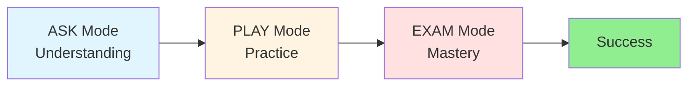

**ASK Mode** - Transform passive reading into active understanding through:
- AI-generated educational videos with animations
- Interactive concept flowcharts showing topic relationships
- Multi-document Q&A for comprehensive research
- Homework mode that guides without giving answers

**PLAY Mode** - Reinforce learning through gamification:
- Interactive educational games
- Comprehensive scoring and progression systems
- Adaptive difficulty that matches skill level
- Performance analytics to track improvement

**EXAM Mode** - Systematic exam preparation with:
- Automated study plan generation
- Countdown timers and daily schedules
- Weak spot identification from quiz performance
- Full-length mock examinations
- Cram mode for last-minute review

### Market Opportunity

**Target Market:**
- College students (19-24 years): 20M in US alone
- High school students (15-18 years): 15M in US
- Professional learners (25-40 years): 50M pursuing certifications

**Market Size:**
- Global EdTech market: $340B (2024)
- Growing at 16% CAGR
- AI-powered learning: $6B subset, fastest growing segment

---

## Product Vision

### Mission Statement

"Empower every student to achieve academic excellence through AI-powered, personalized learning experiences that adapt to their unique needs and learning style."

### Core Values

1. **Student-Centric**: Every feature designed around student needs
2. **Evidence-Based**: Learning methods grounded in cognitive science
3. **Accessible**: Available to all students regardless of device or location
4. **Transparent**: Clear explanations of how AI assists learning
5. **Privacy-First**: Student data protected and never sold

### Product Principles

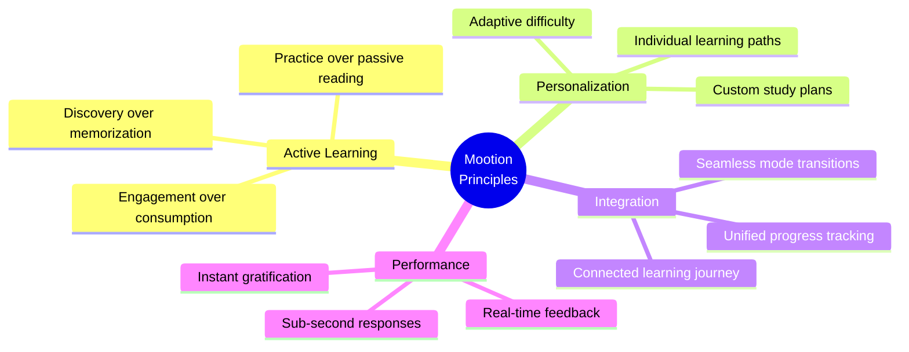

### User Personas

**Primary Persona: Sarah - College Student**
- **Age:** 20
- **Context:** Junior studying Computer Science, preparing for algorithms midterm
- **Goals:** Understand complex topics quickly, identify weak areas, ace exams
- **Pain Points:** Overwhelmed by textbook volume, unsure where to focus
- **Tech Savvy:** High - uses laptop and phone interchangeably
- **Study Pattern:** 2-3 hour evening sessions, prefers visual learning
- **Quote:** "I need to know what I don't know so I can focus my limited time"

**Secondary Persona: Alex - High School Student**
- **Age:** 16
- **Context:** Sophomore taking AP Calculus, needs homework help
- **Goals:** Complete homework correctly, understand concepts deeply
- **Pain Points:** Wants help but needs to learn independently
- **Tech Savvy:** Medium - primarily mobile user
- **Study Pattern:** After-school homework sessions, easily distracted
- **Quote:** "I want hints, not answers - I need to actually learn this"

**Tertiary Persona: Jordan - Professional Learner**
- **Age:** 28
- **Context:** Software engineer pursuing AWS certification
- **Goals:** Master new skills efficiently, validate knowledge
- **Pain Points:** Limited time, needs efficient learning methods
- **Tech Savvy:** Very high - expects polished UX
- **Study Pattern:** Weekend study blocks, focused and goal-oriented
- **Quote:** "Time is my most valuable resource - I need maximum efficiency"

---

## System Architecture Overview

### High-Level System Design

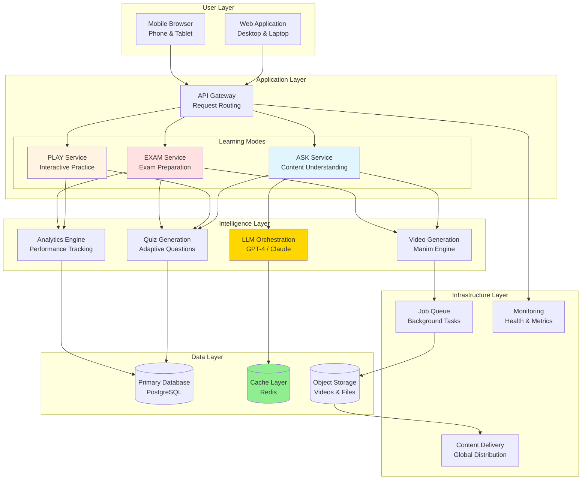

### Learning Journey Flow

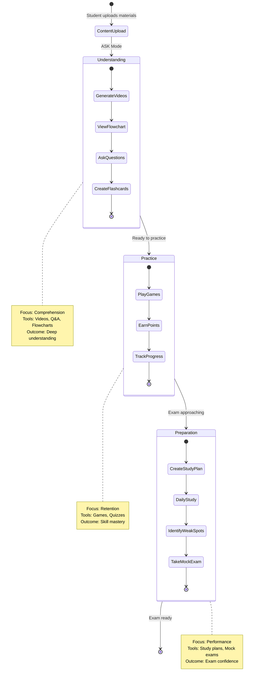

### Data Flow Architecture

```mermaid
graph LR
    subgraph "Content Creation Flow"
        A1[Upload Document] --> A2[Extract Text]
        A2 --> A3[Generate Videos]
        A3 --> A4[Create Quizzes]
        A4 --> A5[Build Flowchart]
    end
    
    subgraph "Learning Flow"
        B1[Watch Videos] --> B2[Take Quizzes]
        B2 --> B3[Play Games]
        B3 --> B4[Track Performance]
    end
    
    subgraph "Preparation Flow"
        C1[Set Exam Date] --> C2[Generate Plan]
        C2 --> C3[Daily Study]
        C3 --> C4[Identify Gaps]
        C4 --> C5[Mock Exams]
    end
    
    A5 --> B1
    B4 --> C1
    C4 --> B2
    
    style A1 fill:#e1f5ff
    style B1 fill:#fff4e1
    style C1 fill:#ffe1e1
```

---

## Functional Requirements

### FR-1: ASK Mode - Content Understanding

#### FR-1.1: Concept Flowchart Generator

**Priority:** HIGH  
**Complexity:** HIGH  
**Business Value:** Transforms passive document reading into active concept mapping

**User Story:**
> As a student studying from a textbook,  
> I want to see a visual map of how concepts relate to each other,  
> So that I understand prerequisites and learning paths.

**Functional Description:**

The Concept Flowchart Generator analyzes uploaded documents and creates interactive visual maps showing:
- Key concepts extracted from the content
- Prerequisite relationships (what must be learned first)
- Related concepts (topics that connect)
- Difficulty progression (fundamental → intermediate → advanced)
- Direct links to generate videos for any concept

**System Behavior:**

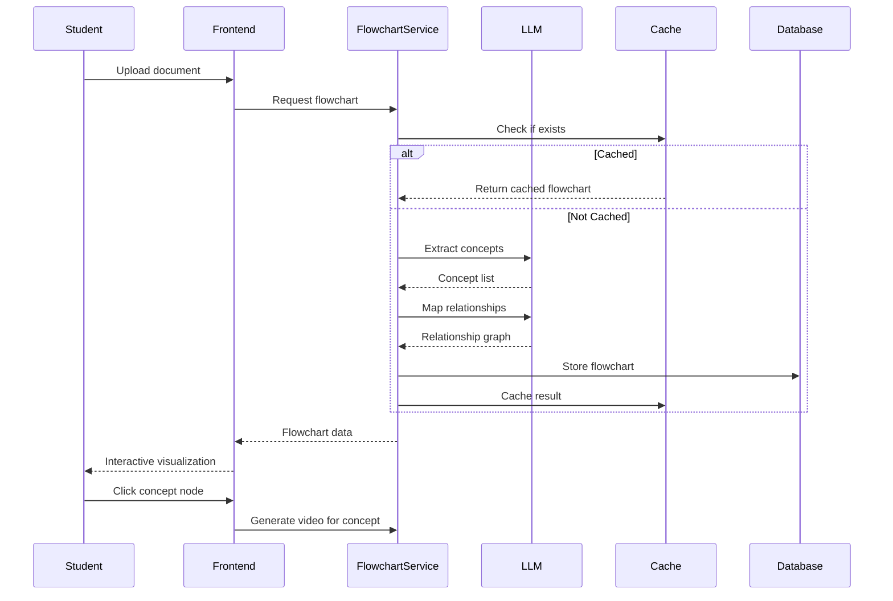

**Concept Extraction Process:**

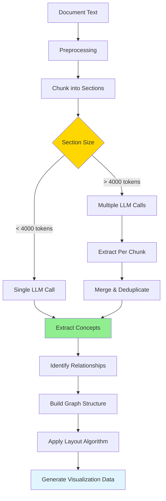

**Acceptance Criteria:**

1. **Document Processing**
   - Support PDF, DOCX, TXT formats up to 500 pages
   - Extract text with >95% accuracy
   - Handle documents with images, tables, equations
   - Process within 30 seconds for 100-page document

2. **Concept Extraction**
   - Extract 15-50 concepts per 100 pages
   - Accuracy >85% (validated against manual review)
   - Include concept name, description, difficulty level
   - Avoid duplicate or overlapping concepts

3. **Relationship Mapping**
   - Identify prerequisite relationships (A must be learned before B)
   - Map related concepts (A and B are connected topics)
   - Assign difficulty levels (fundamental/intermediate/advanced)
   - Handle circular dependencies gracefully

4. **Visualization**
   - Render interactive flowchart within 5 seconds
   - Support zoom (10%-500%), pan, drag-to-rearrange
   - Display up to 100 nodes without performance issues
   - Responsive layout for mobile, tablet, desktop
   - Color-code by difficulty level

5. **Interactivity**
   - Click any node to generate explanatory video
   - Hover to show concept description
   - Filter by difficulty level
   - Search within flowchart
   - Highlight learning paths

6. **Export**
   - Export as PNG (minimum 1920x1080 resolution)
   - Export as SVG (vector format for scaling)
   - Export as PDF with clickable links
   - Generation time <10 seconds

**Success Metrics:**
- 70% of users find flowcharts helpful (user survey)
- 50% of video generations originate from flowchart clicks
- Time to understand document structure reduced by 40%
- 80% of extracted concepts validated as accurate

#### FR-1.2: Homework Mode

**Priority:** HIGH  
**Complexity:** MEDIUM  
**Business Value:** Differentiates Mootion from answer-providing tools by fostering genuine learning

**User Story:**
> As a student working on homework,  
> I want AI guidance without direct answers,  
> So that I learn by solving problems myself while getting unstuck when needed.

**Functional Description:**

Homework Mode transforms the AI from an answer provider into a learning coach. When activated, the system:
- Provides guiding questions instead of direct answers
- Uses Socratic method to lead students to discoveries
- Tracks time spent on homework
- Records session for later review
- Marks completion with summary

**Behavioral Transformation:**

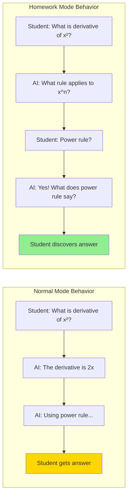

**Session Lifecycle:**

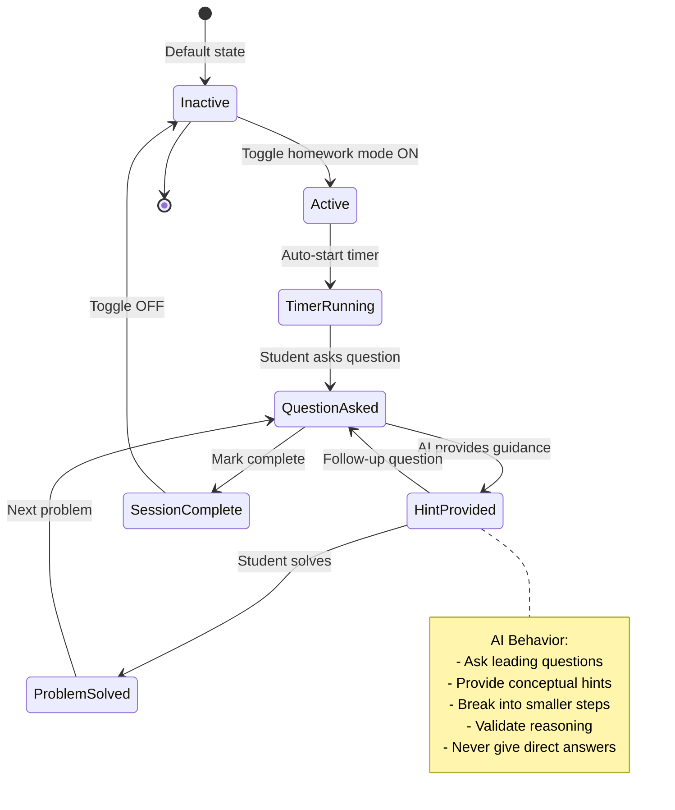

**Acceptance Criteria:**

1. **Mode Toggle**
   - Prominent toggle switch in ASK mode interface
   - Clear visual indicator when homework mode active (color change, icon)
   - State persists across page refreshes
   - Can toggle on/off mid-session
   - Confirmation dialog when toggling off with unsaved work

2. **Timer Functionality**
   - Starts automatically when homework mode enabled
   - Displays elapsed time in HH:MM:SS format
   - Continues running across page refreshes
   - Pauses when browser tab inactive (optional setting)
   - Stops when session marked complete
   - Shows total time in session summary

3. **AI Behavior Modification**
   - 100% of responses use guiding questions (no direct answers)
   - Provides hints in progressive levels:
     - Level 1: Conceptual hint (which principle applies?)
     - Level 2: Directional hint (what's the first step?)
     - Level 3: Specific hint (consider this formula)
   - Uses Socratic method for problem-solving
   - Validates student reasoning without solving
   - Encourages independent thinking with positive reinforcement

4. **Session Tracking**
   - Records all questions and AI responses
   - Tracks total time spent
   - Counts hints used per problem
   - Saves session state automatically every 30 seconds
   - Allows session resume from any point
   - Marks completion with timestamp

5. **Session Summary**
   - Total time spent
   - Number of problems attempted
   - Hints used per problem
   - Topics covered
   - Suggested review areas
   - Export as PDF for records

**Success Metrics:**
- Students spend 40% more time engaging with material in homework mode
- 80% report better understanding after homework sessions (survey)
- Average session duration: 45-90 minutes
- Hint usage decreases 30% over 2 weeks (learning curve indicator)
- 85% completion rate for started sessions

---

#### FR-1.3: Video Library System

**Priority:** CRITICAL  
**Complexity:** HIGH  
**Business Value:** Transforms one-time content into persistent, searchable knowledge base

**User Story:**
> As a student who has generated many videos,  
> I want to organize, search, and rediscover my video collection,  
> So that I can review topics efficiently without regenerating content.

**Functional Description:**

The Video Library provides comprehensive management for all generated educational videos:
- Centralized storage with multiple backend options
- Full-text search across titles, topics, transcripts
- Multi-dimensional filtering (date, topic, document, duration)
- Thumbnail previews and metadata display
- Batch operations for organization
- Quick generation from chat conversations

**Video Library Architecture:**

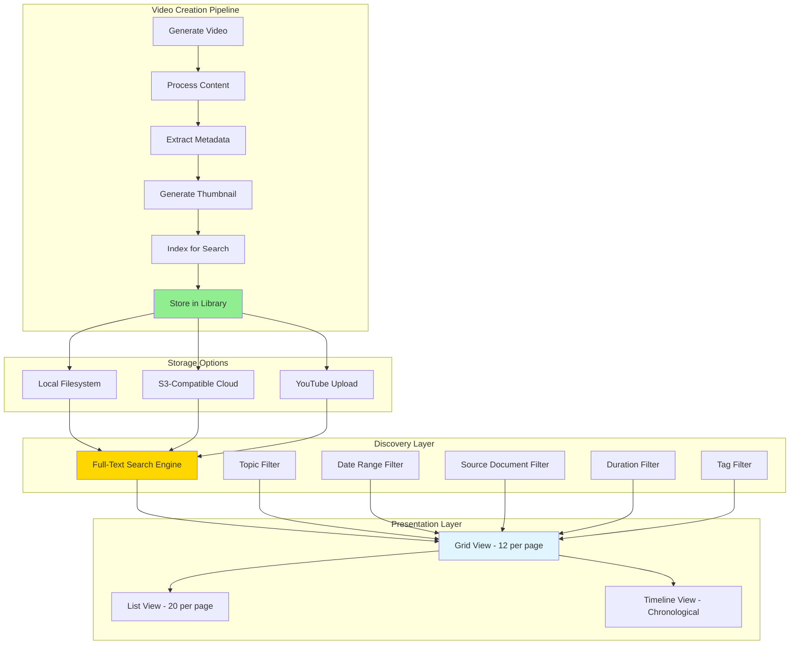

**Search & Discovery Flow:**

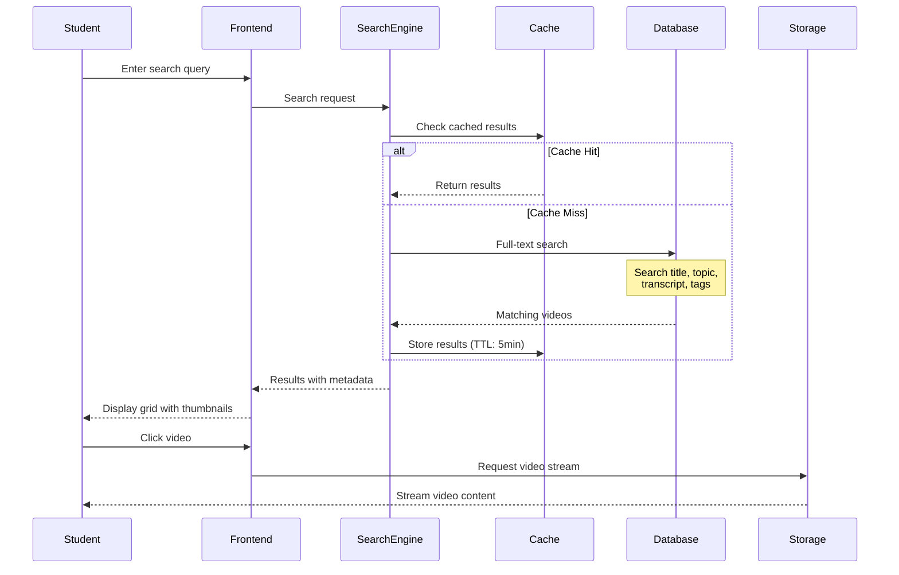

**Acceptance Criteria:**

1. **Storage Management**
   - Support local filesystem storage with organized structure
   - Support S3-compatible cloud storage (AWS S3, MinIO, DigitalOcean Spaces)
   - Optional YouTube upload integration
   - Automatic video compression (target: 2MB per minute)
   - Organized folder structure: /year/month/day/video_id
   - Storage quota management per user (configurable)
   - Automatic cleanup of old videos (configurable retention policy)

2. **Metadata & Indexing**
   - Automatic thumbnail generation from first frame or key moment
   - Extract and store: title, topic, duration, transcript, source document
   - Full-text indexing of title, topic, transcript content
   - Support manual and auto-generated tags
   - Track view count and last viewed timestamp
   - Store creation and modification timestamps
   - Link to source document and chat conversation

3. **Search Functionality**
   - Full-text search across all metadata fields
   - Search results return in <500ms
   - Relevance ranking: title (highest) > topic > transcript
   - Search suggestions and autocomplete
   - Fuzzy matching for typos (Levenshtein distance)
   - Support boolean operators (AND, OR, NOT)
   - Highlight search terms in results

4. **Filtering System**
   - Filter by topic (multi-select dropdown)
   - Filter by date range (calendar picker with presets)
   - Filter by source document (dropdown)
   - Filter by duration (short <5min, medium 5-15min, long >15min)
   - Filter by tags (multi-select)
   - Combine multiple filters with AND logic
   - Show result count for each filter option

5. **Organization Views**
   - Grid view: 12 videos per page with large thumbnails
   - List view: 20 videos per page with compact layout
   - Timeline view: Chronological with date separators
   - Sort options: date (newest/oldest), title (A-Z), duration, views
   - Pagination with page size options (12, 24, 48)
   - Infinite scroll option (user preference)

6. **Video Management**
   - Rename videos with inline editing
   - Edit metadata: title, topic, tags
   - Delete with confirmation dialog
   - Batch operations: select multiple, delete/tag/move
   - Duplicate detection and merge suggestions
   - Archive old videos (hide from main view)
   - Restore archived videos

7. **Quick Actions**
   - "Generate video from this chat" button in chat interface
   - Preview on hover (3-second clip)
   - Share video link (public/private options)
   - Download video file
   - Regenerate thumbnail
   - Copy transcript
   - Add to playlist/collection

**Success Metrics:**
- Users find any video in <10 seconds
- 90% of generated videos accessed more than once
- Search accuracy >95% (relevant results in top 5)
- 60% of users organize videos with tags
- Zero data loss across storage backends
- Average of 50 videos per active user per month

#### FR-1.4: Multi-Document Support

**Priority:** HIGH  
**Complexity:** HIGH  
**Business Value:** Enables comprehensive research and cross-referencing across multiple sources

**User Story:**
> As a student studying from multiple textbooks,  
> I want to ask questions that span all my sources,  
> So that I can synthesize information and see different perspectives.

**Functional Description:**

Multi-Document Support allows students to load and query across up to 10 documents simultaneously, with intelligent source attribution and cross-document reasoning.

**Multi-Document Architecture:**

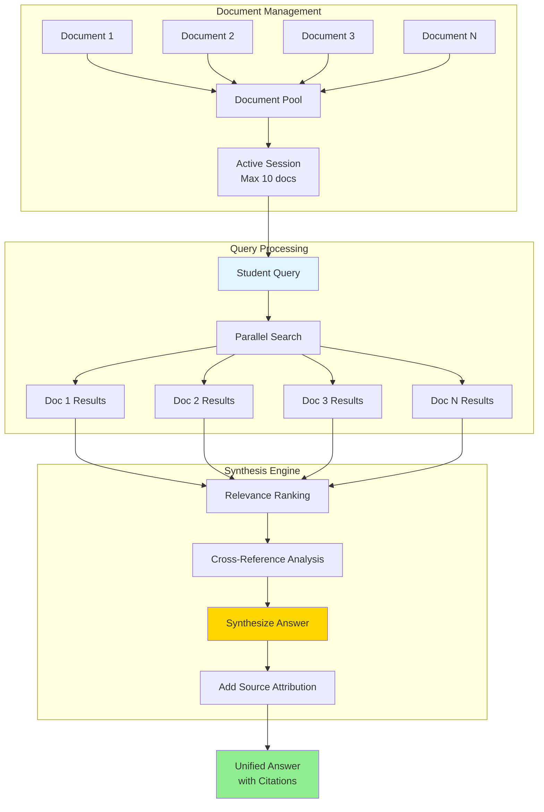

**Cross-Document Query Flow:**

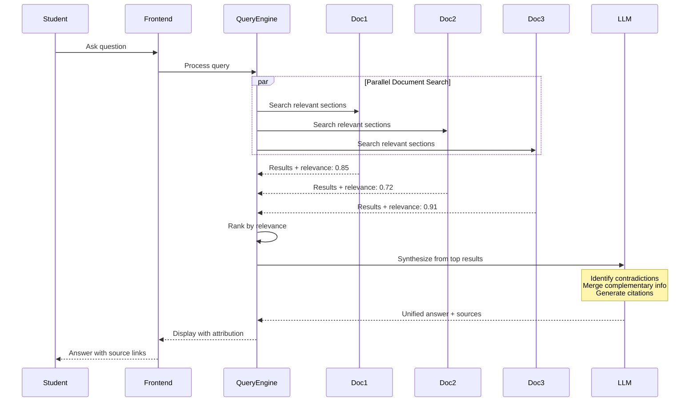

**Acceptance Criteria:**

1. **Document Loading**
   - Load up to 10 documents simultaneously
   - Display document sidebar with all loaded sources
   - Show document metadata: title, pages, upload date, file size
   - Visual indicator for active/inactive documents
   - Remove individual documents without session restart
   - Persist document selection across browser sessions
   - Drag-and-drop reordering of documents

2. **Query Processing**
   - Search across all loaded documents in parallel
   - Complete multi-doc queries within 8 seconds
   - Maintain conversation context across all documents
   - Handle documents of varying lengths (10-500 pages)
   - Support mixed document types (PDF, DOCX, TXT)
   - Process queries up to 500 words

3. **Source Attribution**
   - Highlight which documents contributed to each answer
   - Provide specific page numbers for citations
   - Show relevance score per document (0-100%)
   - Display confidence level for each source
   - Link citations back to original document sections
   - Color-code sources for visual distinction

4. **Cross-Document Reasoning**
   - Identify contradictions between sources
   - Synthesize complementary information
   - Compare different explanations of same concept
   - Highlight unique information per source
   - Generate comparative summaries
   - Show consensus vs. divergent viewpoints

5. **User Interface**
   - Collapsible document sidebar (mobile-friendly)
   - Color-coded source indicators in answers
   - Click citation to view source context in modal
   - Filter answers by specific documents
   - Visual representation of document contribution (pie chart)
   - Document relevance heatmap

6. **Performance**
   - Initial document loading: <5 seconds per document
   - Query response time: <8 seconds for 10 documents
   - Smooth scrolling with large documents
   - Efficient memory usage (no browser crashes)
   - Background indexing doesn't block UI

**Success Metrics:**
- 60% of study sessions use multi-doc feature
- Source attribution accuracy >90%
- Users successfully synthesize information from 3+ sources
- Cross-document queries complete in <8 seconds
- 75% of users find multi-doc feature valuable (survey)
- Average of 4 documents loaded per session

---

### FR-2: PLAY Mode - Interactive Learning

#### FR-2.1: Comprehensive Scoring System

**Priority:** HIGH  
**Complexity:** MEDIUM  
**Business Value:** Gamifies learning to increase engagement and time-on-platform

**User Story:**
> As a competitive learner,  
> I want to track my scores and see my improvement,  
> So that I stay motivated and can measure my progress.

**Functional Description:**

The Scoring System gamifies learning through points, streaks, and progression levels, providing immediate feedback and long-term motivation.

**Scoring Architecture:**

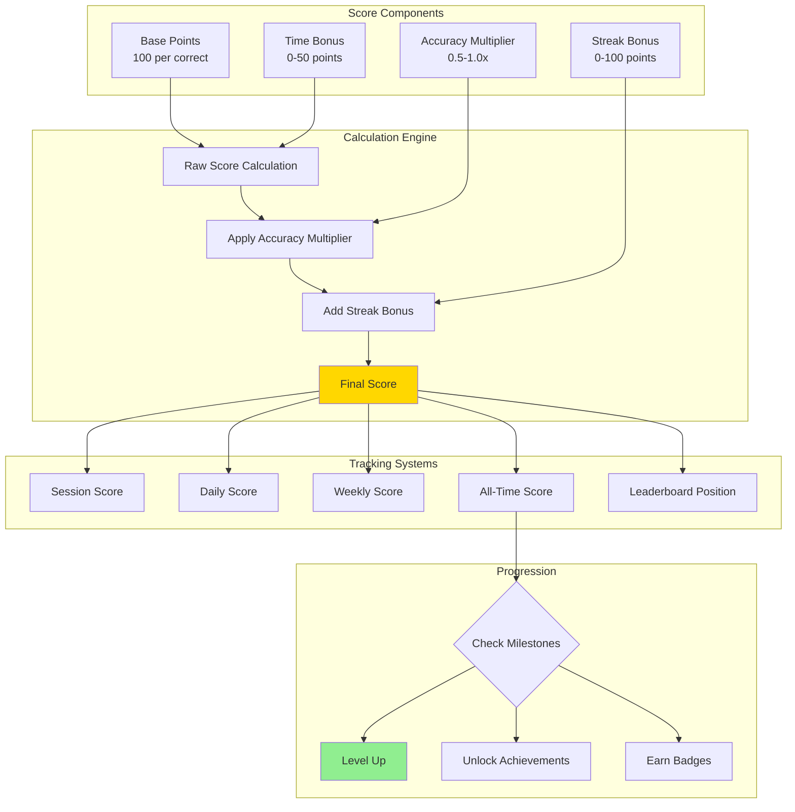

**Scoring Formula Breakdown:**

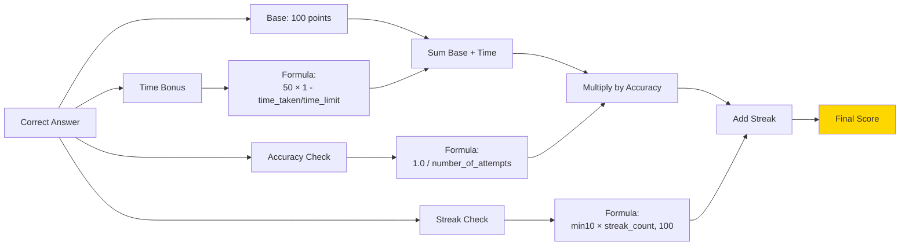

**Progression System:**

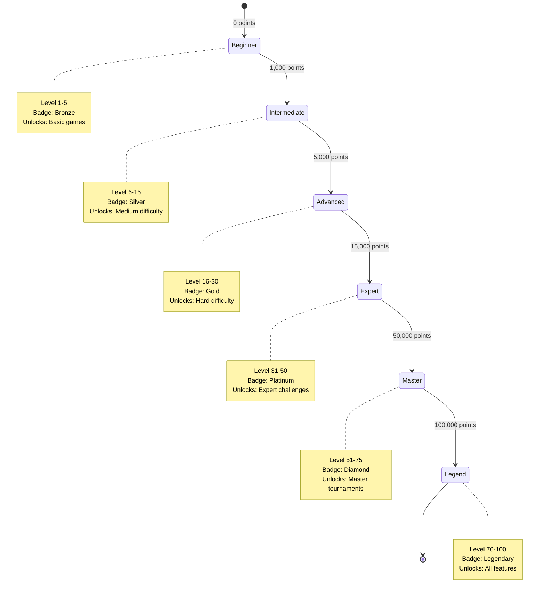

**Acceptance Criteria:**

1. **Score Calculation**
   - Base 100 points for each correct answer
   - Time bonus: 0-50 points based on speed (linear decay)
   - Accuracy multiplier: 1.0 first attempt, 0.5 second, 0.33 third
   - Streak bonus: 10 points per consecutive correct (max 100)
   - Real-time calculation (<100ms latency)
   - Visible score breakdown after each question

2. **Score Display**
   - Current session score prominently displayed
   - Cumulative score by game type
   - All-time total score
   - Animated score increases with sound effects
   - Score breakdown tooltip on hover
   - Progress bar to next level

3. **Streak Tracking**
   - Track consecutive correct answers
   - Visual streak counter with flame icon
   - Streak milestone celebrations (5, 10, 25, 50, 100)
   - Streak reset on incorrect answer with animation
   - Highest streak record displayed
   - Streak recovery bonus (get 3 correct to restart)

4. **Leaderboards**
   - Daily leaderboard (resets at midnight local time)
   - Weekly leaderboard (resets Monday 00:00)
   - Monthly leaderboard
   - All-time leaderboard
   - Per-game-type leaderboards
   - Friend leaderboards (if social features enabled)
   - Top 100 displayed, user's position always shown

5. **Achievements & Badges**
   - Score milestones: 1K, 5K, 10K, 25K, 50K, 100K
   - Streak achievements: 10, 25, 50, 100 consecutive
   - Perfect game achievements (100% accuracy)
   - Speed achievements (fastest completion times)
   - Topic mastery badges (90%+ accuracy in topic)
   - Special event badges (seasonal, challenges)
   - Badge showcase on profile

6. **Level System**
   - 100 levels total
   - XP required increases exponentially
   - Level-up animations and celebrations
   - Unlock new features at milestone levels
   - Level displayed next to username
   - Level-based matchmaking (optional)

7. **Analytics Dashboard**
   - Score history graph (last 30 days)
   - Performance by topic (bar chart)
   - Best/worst game types (radar chart)
   - Improvement trends (line graph)
   - Time spent vs. score correlation
   - Predicted next level-up date

**Success Metrics:**
- 70% of users engage with scoring features
- Average session length increases by 30%
- Users return 2x more frequently with scoring enabled
- Streak feature drives 40% more consecutive sessions
- 50% of users reach Intermediate level within 2 weeks
- 85% of users check leaderboard at least weekly

---

## Non-Functional Requirements

### NFR-1: Performance Requirements

**Response Time:**
- API endpoints: <500ms (95th percentile)
- Video generation: <2 minutes for 1-minute video
- Database queries: <200ms (average)
- Cache responses: <50ms
- Page load time: <2 seconds on 4G connection
- Search results: <500ms

**Throughput:**
- Support 100 concurrent users minimum
- Handle 1,000 requests per minute
- Process 50 video generation jobs simultaneously (queued)
- Support 10,000 daily active users

**Scalability:**
- Horizontal scaling for API servers
- Database read replicas for query distribution
- CDN for static asset delivery
- Auto-scaling based on load (CPU >70%)

### NFR-2: Reliability Requirements

**Availability:**
- 99.5% uptime (excluding planned maintenance)
- Maximum 4 hours downtime per month
- Planned maintenance windows: Sunday 2-4 AM local time

**Data Integrity:**
- Zero data loss for user content
- Automatic backup: daily full, hourly incremental
- Point-in-time recovery up to 30 days
- Transaction consistency for critical operations

**Fault Tolerance:**
- Graceful degradation when services fail
- Video generation failures don't crash system
- Automatic retry for transient failures (3 attempts)
- Circuit breaker pattern for external services
- Health check endpoints for monitoring

### NFR-3: Security Requirements

**Authentication & Authorization:**
- JWT-based authentication with refresh tokens
- Role-based access control (student, teacher, admin)
- Session timeout after 24 hours of inactivity
- Password requirements: min 8 chars, uppercase, lowercase, number
- Two-factor authentication (optional)

**Data Protection:**
- HTTPS/TLS 1.3 for all communications
- Encryption at rest for sensitive data (AES-256)
- Input sanitization to prevent injection attacks
- File upload validation (type, size, content)
- Rate limiting: 100 requests/minute per user

**Privacy:**
- GDPR compliance for data deletion
- User data isolation (no cross-user access)
- Anonymized analytics
- No selling of user data
- Clear privacy policy and terms of service

### NFR-4: Usability Requirements

**User Interface:**
- Intuitive navigation (max 3 clicks to any feature)
- Consistent design language across all modes
- Accessibility compliance (WCAG 2.1 Level AA)
- Keyboard shortcuts for power users
- Dark mode support
- Responsive design (320px to 4K)

**User Experience:**
- Onboarding tutorial for new users (<5 minutes)
- Contextual help and tooltips
- Clear error messages with actionable guidance
- Progress indicators for long operations
- Undo/redo functionality where applicable
- Auto-save every 30 seconds

**Internationalization:**
- Support for English (primary)
- Expandable to 10+ languages
- RTL language support (Arabic, Hebrew)
- Localized date/time formats
- Currency formatting (if applicable)

### NFR-5: Maintainability Requirements

**Code Quality:**
- Unit test coverage >80%
- Integration tests for critical workflows
- End-to-end tests for user journeys
- Code documentation and inline comments
- Consistent coding standards (linters, formatters)

**Monitoring & Logging:**
- Application performance monitoring (APM)
- Error tracking and alerting
- User analytics and usage metrics
- System health dashboards
- Log retention: 90 days

**Deployment:**
- Containerized deployment (Docker)
- CI/CD pipeline for automated testing and deployment
- Blue-green deployment for zero-downtime updates
- Rollback capability within 5 minutes
- Infrastructure as code (Terraform/CloudFormation)

---

## Success Metrics

### User Engagement Metrics
- **Daily Active Users (DAU):** Target 10,000 within 6 months
- **Monthly Active Users (MAU):** Target 30,000 within 6 months
- **DAU/MAU Ratio:** >33% (indicates sticky product)
- **Average Session Duration:** >25 minutes
- **Sessions per User per Week:** >3
- **Feature Adoption Rate:** >60% for new features within 30 days
- **User Retention:** >70% after 30 days, >50% after 90 days

### Performance Metrics
- **Video Generation Time:** <2 minutes (95th percentile)
- **API Response Time:** <500ms (95th percentile)
- **Database Query Time:** <200ms (average)
- **Cache Hit Rate:** >60%
- **Page Load Time:** <2 seconds
- **System Uptime:** >99.5%
- **Error Rate:** <1% of all requests

### Learning Outcome Metrics
- **Exam Pass Rate Improvement:** +25% compared to baseline
- **Study Efficiency:** 35% reduction in time to mastery
- **User Satisfaction Score:** >4.5/5
- **Net Promoter Score (NPS):** >50
- **Concept Retention:** 80% after 1 week (measured via quizzes)
- **Homework Completion Rate:** >85%

### Business Metrics
- **Cost per User:** <$2/month
- **Customer Acquisition Cost (CAC):** <$20
- **Lifetime Value (LTV):** >$100
- **LTV/CAC Ratio:** >5:1
- **Support Ticket Volume:** <5% of active users per month
- **Feature Completion Rate:** >85% of planned features
- **Platform Uptime:** >99.5%

---

**End of Requirements Document**

---

## Appendix

### Glossary

- **ASK Mode:** Content understanding mode focused on video generation, Q&A, and concept mapping
- **PLAY Mode:** Interactive learning mode with games, scoring, and practice
- **EXAM Mode:** Exam preparation mode with study plans, mock exams, and weak spot identification
- **Concept Flowchart:** Visual map showing relationships between topics
- **Homework Mode:** AI guidance mode that provides hints instead of direct answers
- **Cram Mode:** Condensed study mode for last-minute exam preparation
- **Mock Exam:** Full-length practice examination simulating real exam conditions
- **Weak Spot:** Topic with <70% quiz accuracy requiring focused practice
- **Streak:** Consecutive correct answers in games
- **LLM:** Large Language Model (e.g., GPT-4, Claude)
- **CDN:** Content Delivery Network for fast global content distribution
- **TTL:** Time To Live (cache expiration time)

### References

- Cognitive Load Theory (Sweller, 1988)
- Spaced Repetition Research (Ebbinghaus, 1885)
- Gamification in Education (Deterding et al., 2011)
- Socratic Method in Teaching (Paul & Elder, 2007)
- WCAG 2.1 Accessibility Guidelines
- GDPR Compliance Requirements

### Document History

| Version | Date | Author | Changes |
|---------|------|--------|---------|
| 1.0 | 2026-02-15 | Mootion Team | Initial requirements document |

